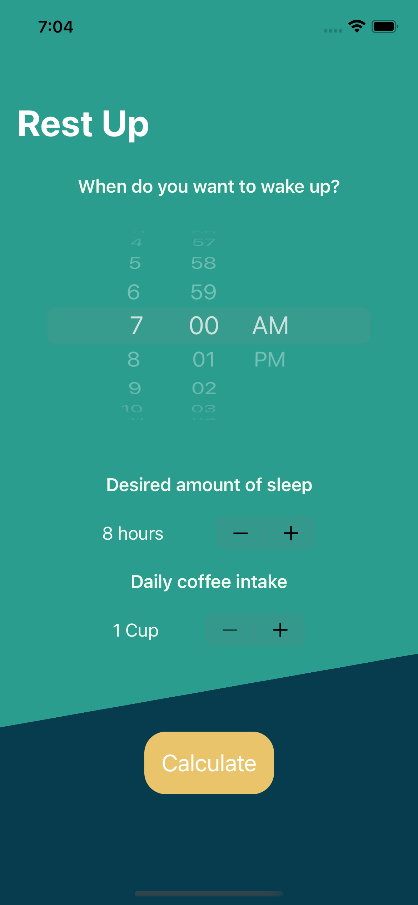

# rest-up
An app developed to predict an appropriate sleep time using Apple's frameworks in CreateML and CoreML.
Input a desired wake-up time, amount of coffees consumed and the model will return an appropriate sleep time.

This project focuses on adding forms, bindings whilst also introducing UI elements such as:
`DatePicker`, `Stepper`, `navigationBarItems()`, `Date`, `DateComponents` and `DateFormatter`

NOTE: The test data used to create this app is not medically sourced and should not be used to provide any professional or medical advice.

### Screenshots:
 

This project was created in accordance with Paul Hudson's tutorial [HackingWithSwift](https://www.hackingwithswift.com)
